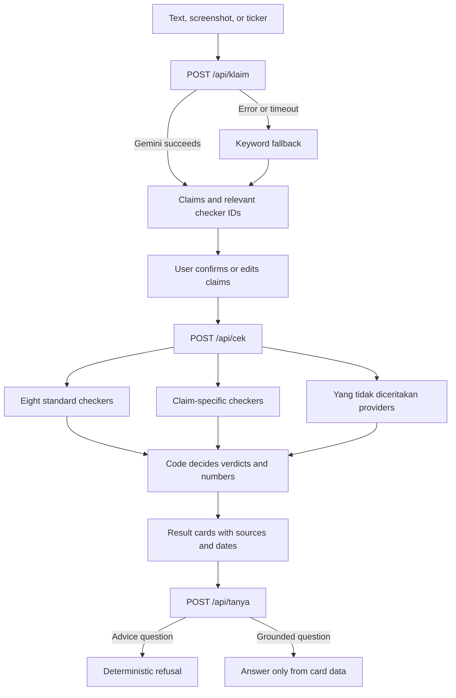

# cek dulu.

> Beginner investors in Indonesia often buy stocks because of claims in WhatsApp groups and forums ("profit up 200%", "foreigners are buying it all up", "it's going to the moon") that they never check against the data.

**cek dulu.** ("check first") splits a group message into claims, then checks each claim against market data from [Sectors](https://sectors.app) using **written rules**. The result is a verdict stamp, a reason, the numbers, and the sources, which can be sent back to the group.

**The rules decide, not AI.** AI only reads text/screenshots, splits claims, and rewrites the result in everyday language. Verdicts, numbers, and data selection are computed by code in `backend/app/checkers/`, and every rule has a test in `backend/tests/test_aturan.py`.

The app's UI is in Indonesian, because it is built for Indonesian retail investors and covers stocks listed on the Indonesia Stock Exchange (IDX).

Sectors Hackathon 2026 · Track 3 Market Intelligence · Not investment advice.

## Submission links

- App: https://cekdulu-zeta.vercel.app
- Demo video (≤3 minutes): **pending D6 upload**
- Teaser (≤1 minute): **pending D6 upload**

The two video placeholders must be replaced before the submission is frozen on
8 Oct 2026 at 23:59 WIB.

---

## Running it

Requires Python 3.11+ and Node 20+.

```bash
cp .env.example .env            # keep fixture mode; add LLM_API_KEY only to use Gemini
git config core.hooksPath .githooks   # once per clone: strips AI attribution from commit messages

# backend
cd backend
python -m venv .venv && .venv\Scripts\activate      # Windows (macOS/Linux: source .venv/bin/activate)
pip install -r requirements.txt
python scripts/buat_fixture.py   # build data/fixtures from the data-lab cache (0 credits); see data/fixtures/README.md
pytest -q
uvicorn app.main:app --reload --port 8000

# frontend (another terminal)
cd frontend
cp .env.example .env.local       # VITE_API_MODE=mock (no backend) or api
npm install
npm run dev                      # http://localhost:5173
```

### Data modes

| | Frontend `VITE_API_MODE` | Backend `CEKDULU_DATA_MODE` |
|---|---|---|
| Start FE work without a backend | `mock` | – |
| BE returns the contract examples | `api` | `mock` |
| **Demo** (real rules, stored data, 0 credits) | `api` | `fixture` |
| Stocks outside the fixtures (uses credits, capped by `SECTORS_CREDIT_BUDGET`) | `api` | `live` |

The demo and automated tests use `fixture`; they do not call the Sectors API.
Do not enable `live` or run `buat_fixture.py --live` without team approval.

## Structure

```
contract/            FE ↔ BE agreement: rules.json (all rules + thresholds) and example JSON
backend/
  app/
    main.py          FastAPI endpoints
    engine.py        runs checkers → verdict, form, "Yang tidak diceritakan" (no AI)
    checkers/        8 standard checkers + modules; pure rule functions `aturan_xx`
    untold/          extra "Yang tidak diceritakan" (what they didn't tell you) cards
    modul/           Free Float Radar, stock vs commodity
    data/            Sectors adapter (fixture/cache/live), parsers, CSV reader
    ai/              claim splitter (LLM + no-AI fallback), investment-advice refusal
  scripts/           buat_fixture.py
  tests/             rule, contract, and API tests
frontend/            Vite + React + TypeScript + Tailwind
data/
  bahan_produk/      data-lab CSVs (World Bank, BPS, FRED, IDX, Sectors) + KAMUS_DATA.md
  fixtures/          Sectors JSON per stock for the demo (not committed)
docs/
  FINAL_PLAN_cekdulu.md   product plan (source of truth for the product)
  DATA_NOTES.md           Sectors JSON shapes + data pitfalls
  lanes/A–D.md            detailed brief per task
LANES.md             team task split
AGENTS.md, CLAUDE.md rules for AI coding agents (and humans)
```

## Flow of one check



Verdicts in English: `sesuai` = matches the data · `menyesatkan` = misleading · `tidak_sesuai` = contradicts the data · `tidak_bisa_dicek` = can't be checked · `info` = context.

## AI provider

The selected provider is the Gemini Developer API with the stable
`gemini-3.1-flash-lite` model. It has a free tier, accepts text and image input,
and is optimized for high-volume, simple processing such as claim extraction.
Gemini also supports structured JSON output. The development API key is held by
the Lane C owner and is never stored in the repository.

Set `LLM_API_KEY` in the root `.env` to enable Gemini. Set
`LLM_PROVIDER=none` to develop or run tests with the keyword fallback and no
external AI calls. Automated tests use fake LLM implementations and must not
call Gemini or Sectors. The default data mode remains `fixture`, so enabling
Gemini does not enable the Sectors API.

Screenshots are read in the same single request: Gemini returns the message
text it read as `source_text`, and code drops any claim or ticker that is not
in that text before the confirm screen highlights it. Without Gemini a
screenshot cannot be read, so the user is asked to paste the text instead.
Screenshots on the free tier may be used by Google, so the input screen asks
users to crop names and phone numbers. Measured from a home connection, the
free model took 10–14 seconds per text message, so the read timeout is 20
seconds (`BATAS_WAKTU` in `backend/app/ai/gemini.py`); lower it for a faster
model.

C0's evaluation set contains ten Indonesian stock messages: the four product examples plus
mixed data/prediction claims, "ARA", "asing net buy", multiple checks, and two
tickers in one message. The keyword fallback produced valid claim structures
for all ten; its known limitation is that a two-ticker message selects only the
first ticker. One Gemini batch returned schema-valid results for all ten in 6.3
seconds and matched the expected semantics in 8/10 cases. It initially mapped a
prediction about gold to `m_komoditas` and a retail-holder claim to `likuiditas`;
a focused retry after tightening those prompt rules reached the 8-second timeout.
Therefore C1 must keep the hard timeout and automatic `NoLLM` fallback. No more
live requests are used for C0, to conserve the development quota.

### Second classifier: TypeSafe JEV

Ask (Tanya) answers and claim filtering use TypeSafe JEV (`/systemone`), which
only returns scores or labels from a closed set; it never writes text.

- **Ask:** JEV picks which part of the card answers the question (numbers, rule,
  sources, a glossary term, or "not on this card"). Code then writes the
  sentence from the card's own fields (`backend/app/ai/tanya.py`), so no number
  can be invented. JEV is also a second advice guard after the regex: it can
  refuse a question but never allow one the regex refused.
- **Claims:** for each claim, one JEV call flags chatter (greetings,
  questions), pure predictions, and price targets. Code drops chatter and removes
  the checkers from predictions and targets, so they get `tidak_bisa_dicek`.
  JEV can only remove checkers, never add one.

Set `JEV_API_KEY` in the root `.env` to enable it (`TANYA_MODE=off` disables
it). Without a key or when a call fails, Ask answers with a code-only summary
of the card and claims keep the keyword heuristics, so nothing returns an error.

References: [Gemini models](https://ai.google.dev/gemini-api/docs/models),
[Gemini pricing](https://ai.google.dev/gemini-api/docs/pricing), and
[structured output](https://ai.google.dev/gemini-api/docs/structured-output).

### AI boundaries

| AI may | AI may not |
|---|---|
| Read user text and screenshots | Decide a verdict |
| Split a message into exact-substring claims | Compute or invent a number |
| Identify a ticker written in the message | Choose market data |
| Pick IDs from the checker catalogue | Predict a price or return |
| Pick which part of a result card answers a question | Give buy, sell, hold, or target-price advice |
| Flag predictions, price targets, and chatter | Write the text of a Tanya answer |

These limits are enforced in code, not only in prompts. Unknown checker IDs and
hallucinated claims are dropped, spans are recomputed from the source text,
prediction claims receive no checker, advice phrasing is refused by regex before
any model call, and every Tanya answer is assembled by code from the card's own
fields.

## Rules

`contract/rules.json` is the single source of truth for all thresholds. “Usulan”
means the threshold is still a team proposal; the UI must display that label.

| ID | Check | Status | Rule summary |
|---|---|---|---|
| L-1 | Profit | Final | Recompute a claimed profit change; tolerance is 5 percentage points. |
| L-2 | Profit | Final | A selected period is misleading when the four-quarter trend moves the other way. One-off items are not separated (stated in Methodology). |
| V-1 | Valuation | Final | Claimed PER/PBV may differ by at most 15%; missing forward PE is not zero. |
| D-1 | Dividend | Final | "Large dividend" means at least 1.5× sector yield; with no sector source yet, a claim without a number returns insufficient data. A claimed yield more than 2 points off the 12-month yield is misleading. |
| D-2 | Dividend | Final | Payout above 100% is a finding, because it exceeds profit and may not recur. |
| O-1 | Insider | Final | Flag insider transactions above Rp1 billion within 12 months. |
| A-1 | Foreign flow | Final | "Foreigners are buying" requires positive 20-day net flow and inflow on at least 60% of days. |
| A-2 | Foreign flow | Final | Foreign/retail-holder trend over 3–6 monthly observations within one issuer; changes under 1 point are flat. |
| A-3 | Foreign flow | Proposed | A claim without a period is misleading when A-1 and A-2 point in opposite directions; a stated period selects A-1 or A-2. |
| H-1 | Price jump | Final | Flag changes above 25% over 21 trading days, excluding corporate-action dates. |
| H-2 | Price claim | Final | "From A to B" matches when A was a daily close anywhere in the window and the latest close is within 10% of B. |
| S-1 | Suspension | Final | Flag an exchange suspension within the last 36 months and show the stated reason. |
| F-1 | Free float | Final | Flag public ownership below 15% and activate Free Float Radar. |
| R-1 | Free Float Radar | Final | Estimate value to release and absorption days; pressure bands are <20, 20–60, and >60 days. |
| K-1 | Commodity | Final | "Stock X is commodity Y" is misleading when Y contributes below 50% of revenue. |
| K-2 | Commodity | Final | Monthly correlation is weak below 0.3, medium at 0.3–0.6, and fairly strong from 0.6. |
| N-1 | Analysts | Proposed | "All analysts say buy" needs every recommendation to be buy/strong buy; "most" needs at least 90%. |
| P-1 | Holders | Proposed | "Retail is piling in" needs the local retail share up at least 1 point and the shareholder count up. |
| Q-1 | Context card | Proposed | Note low liquidity when estimated 60-day average daily value is below Rp1 billion. |
| C-1 | Context card | Proposed | Show corporate actions whose ex-date falls within the next 90 days. |
| T-1 | Prediction | Final | Predictions, opinions, and numberless rumours cannot be checked. |

## Data sources and licences

| Source | Use | Licence / handling |
|---|---|---|
| Sectors REST API v2 | Financials, prices, flows, filings, suspensions, actions, segments, ratings, holders, free float | Used under hackathon/API access. Raw fixtures are intentionally excluded from Git pending redistribution confirmation. |
| World Bank Pink Sheet | Monthly commodity prices | [CC BY 4.0](https://datacatalog.worldbank.org/public-licenses); attribution required. |
| BPS WebAPI `dataexim` | Monthly Indonesian exports | Attribute BPS and follow the [BPS WebAPI terms](https://webapi.bps.go.id/developer/). |
| FRED `CCUSMA02IDM618N` (OECD) | Monthly IDR/USD series | Attribute OECD via FRED and follow the series-specific copyright notice and [FRED terms](https://fred.stlouisfed.org/legal). |
| Indonesia Stock Exchange | Special Monitoring Board snapshot | Manual snapshot dated 30 Sep 2026; attribute IDX and retain its source date. |

Every displayed number carries a source and date. Percentages are stored as
decimals and Rupiah as full amounts; formatting is performed by the frontend.

## Deployment

The selected setup is one Render backend instance plus a Vercel frontend:

1. Deploy the repository through `render.yaml`. In Render, provide
   `LLM_API_KEY` (and optionally `JEV_API_KEY`) and set `CORS_ORIGINS` to the
   final Vercel origin.
2. Run `python deploy/pack_fixtures.py`. In the Render dashboard, create a
   Secret File named `fixtures.zip.b64` and paste the generated file's contents.
   The generated file is ignored by Git; never commit fixture contents. Keep
   `CEKDULU_DATA_MODE=fixture` and `SECTORS_CREDIT_BUDGET=0`.
3. Deploy `frontend/` to Vercel with build command `npm run build`, output
   directory `dist`, `VITE_API_MODE=api`, and
   `VITE_API_BASE=<the Render URL>`.
4. The SPA rewrite lives in `frontend/vercel.json`. Test a deep-link refresh,
   MGLV, MDKA, quota exhaustion, and Tanya from a phone.
5. Free Render services may sleep. Open `/api/health` before recording the demo.

Quota and check results are process-local, so the backend deliberately runs as
a single instance.

## Deliberately not done

- Investment advice, price targets, and predictions: refused by design.
- Full multi-ticker checking in one message: the first ticker is selected; users
  should check the second ticker separately.
- Sectors live mode for the public demo: fixtures avoid spending limited credits
  and keep the recorded results reproducible.
- Durable Tanya/check sessions: a server restart clears in-memory results, and
  the API returns a friendly message asking the user to check again.

## Team

| Lane | Responsibility | Owner |
|---|---|---|
| A | Frontend | Kafi |
| B | Checking engine | Dito |
| C | AI, Tanya, deployment | Aufa |
| D | Modules, extra cards, video | Rakha |

## Before submission

- Replace the two video-link placeholders.
- Decide whether the proposed rules (A-3, N-1, P-1, Q-1, C-1) ship as proposed or final.
- Test the public URL from a real phone and verify MGLV/MDKA fixture numbers.
- Submit before 8 Oct 2026 23:59 WIB, then freeze the repository.
