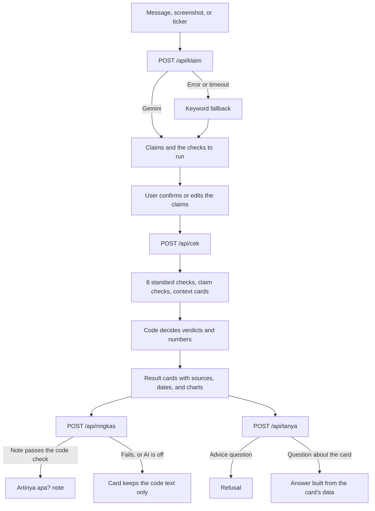

# cek dulu.

> Beginner investors in Indonesia often act on stock claims from WhatsApp groups and forums ("laba naik 200%", "asing borong", "pasti terbang") without checking them against the data.

**cek dulu.** ("check first") takes a pasted group message or a screenshot, splits it into separate claims, and checks each claim against market data from [Sectors](https://sectors.app) using **written rules**. Every claim gets a verdict stamp, the finding, the supporting numbers with their source and date, and the rule that decided it.

**The rules decide, not AI.** Verdicts and numbers are computed by code (`backend/app/checkers/`), every threshold lives in `contract/rules.json`, and every rule has a test. AI only reads the message, splits it into claims, and rewrites a finished result in plain words, and code checks that rewrite before it is shown.

Sectors Hackathon 2026 · Track 3 Market Intelligence · Not investment advice. The app's interface is in Indonesian, because it is built for retail investors on the Indonesia Stock Exchange (IDX).

## Links

- **App:** https://cekdulu-zeta.vercel.app
- **Demo video (≤3 minutes):** pending
- **Teaser (≤1 minute):** pending

## Try it

1. Open the app and tap **Cek klaim**.
2. Tap one of the example messages, then **Pecah jadi klaim** (split into claims) and **Cek sekarang** (check now).
3. Read the cards. **Cara menilai** shows the rule behind a verdict; **Tanya soal ini** answers questions about a card.

| Example message | What you should see |
|---|---|
| `MGLV masih bakal terbang, dari 600 udah 14 ribuan, buruan!` | "Dari 600 udah 14 ribuan" **matches the data**: Rp600 was a recorded closing price and the latest close is Rp14,650 (with a price chart). "Masih bakal terbang" **can't be checked**: it is a prediction. Context the message left out: insider selling, 7 trading suspensions in 36 months, and a past listing on the Special Monitoring Board. |
| `Kata grup, MDKA saham emas, emas lagi naik pasti ikut naik` | "MDKA saham emas" is **misleading**: 82% of revenue comes from nickel and 0% from gold. "Emas lagi naik" (a claim about the gold price, not about MDKA) and "pasti ikut naik" (a prediction) **can't be checked**. |
| `BUMI diserbu ritel, asing juga masuk` | "Diserbu ritel" is **misleading**: the retail share rose, but the number of shareholders fell. "Asing juga masuk" **contradicts the data**: foreign investors sold a net Rp224.1 billion over the last 20 trading days (with a daily chart). |
| `Semua analis rekomendasi buy ANTM` | **Contradicts the data**: 68 of 70 analyst recommendations are buy or strong buy, so not all of them. |

The public demo uses stored Sectors data for ANTM, BBRI, BREN, BUMI, MDKA, MGLV, PSAB, and PTBA; any other code gets a message instead of a check (see [Limitations](#limitations-and-roadmap)). Each browser can run 5 checks a day. The backend sleeps when idle, so the first request after a pause can take up to a minute.

## What a result shows

- **Five verdicts:** *sesuai data* (matches the data) · *menyesatkan* (misleading: true numbers, cherry-picked period or missing context) · *tidak sesuai* (contradicts the data) · *tidak bisa dicek* (prediction, opinion, or rumour) · *info* (context, not a verdict).
- **A card per claim,** read top to bottom: the finding, a short explanation, an **"Artinya apa?"** (what does it mean?) note in plain words, the supporting numbers, a chart for profit, price, and foreign-flow checks, the source and date of every number, and the rule behind the verdict.
- **"Yang tidak diceritakan"** (what they didn't tell you): context the message left out, such as insider selling, trading suspensions, sharp price jumps, upcoming corporate actions, low liquidity, or a Special Monitoring Board listing.
- **An inspection form:** the same 8 standard checks run for every stock, in a fixed order, with their status.
- **Tanya** (ask): follow-up questions answered only from the card's own data; requests for buy/sell advice are refused.
- **Analysis tools:** Free Float Radar (which listed companies must sell shares to the public, and how much pressure that puts on the market) and Stock vs commodity (how much revenue really comes from a commodity, and how closely the share price follows it).
- **Methodology and Kamus:** every rule explained in plain words, and a searchable glossary of the terms behind the ⓘ icons.
- **Share to the group:** the result as a 4:5 image for WhatsApp.

## How a check works



## Why the verdicts can be trusted

- **Written rules, not model judgement.** Each verdict comes from a pure function (numbers in, decision out) whose threshold is read from `contract/rules.json`. The same data and the same claim always give the same verdict. The [Rules](#rules) table below lists all of them, and the app's Methodology page shows each one in plain words.
- **Every number has a source and a date,** shown on the card.
- **Missing data is never filled in.** A check without enough data says so; it never shows a zero or a guess.
- **AI is boxed in by code, not only by prompts:**

| AI may | AI may not |
|---|---|
| Read a pasted message or a screenshot | Decide a verdict |
| Split a message into claims (exact text from the message) | Compute or invent a number |
| Suggest which checks a claim needs, from the catalogue | Choose market data |
| Flag predictions, price targets, and small talk | Predict a price or give buy, sell, hold, or target advice |
| Pick which part of a card answers a Tanya question | Write a card's finding, explanation, or numbers |
| Rewrite a claim card's facts as a short "Artinya apa?" note | Write a Tanya answer |

Code enforces these limits. Unknown checks and claims that aren't in the message are dropped, prediction claims get no check, advice questions are refused by a regex before any model call, and every Tanya answer is assembled by code from the card. An "Artinya apa?" note is shown only if every number in it appears in the card's headline, every direction word (naik, turun, masuk, keluar…) and ticker is one the card itself uses, it names no other verdict, and it contains no advice wording. Otherwise the card keeps the code-written text alone.

### The AI pieces

- **Gemini** (`gemini-3.1-flash-lite`) reads text and screenshots and splits them into claims in one structured-JSON request (`backend/app/ai/gemini.py`). If it fails or takes longer than 20 s, keyword rules split the text instead. Screenshots may be used by Google on the free tier, so the app asks users to crop names and phone numbers first. On a 10-message test set, Gemini returned valid claims for all ten and the expected checks for 8 of 10, which is why the fallback and code checks stay in place.
- **TypeSafe JEV** returns only scores and labels from a closed set; it never writes text (`backend/app/ai/jev.py`). It flags small talk, predictions, and price targets in claims (it can only remove checks, never add one), and picks which part of a card answers a Tanya question. Code then writes the answer from the card's own fields.
- **"Artinya apa?" notes** (`backend/app/ai/ringkas.py`) are requested after the results appear, so a check never waits for them. Gemini receives only the facts of each claim card, and code checks every note as described above.

Without API keys, every AI step falls back to code, and the app still works end to end.

## How cek dulu. uses the Sectors API

| Sectors endpoint | Used for |
|---|---|
| `/v2/company/report/{ticker}/` (overview, ownership, valuation, dividend) | Free float (F-1), valuation (V-1), dividends (D-1, D-2) |
| `/v2/company/report/{ticker}/` (future) | Analyst recommendations and projections (N-1) |
| `/v2/financials/quarterly/{ticker}/` | Quarterly net profit (L-1, L-2) |
| `/v2/daily/{ticker}/` | Closing prices and trading value (H-1, H-2, Q-1) |
| `/v2/foreign-flow/{ticker}/` | Daily foreign net flow (A-1) |
| `/v2/company/shareholders-composition/{ticker}/` | Foreign and retail ownership, shareholder count (A-2, P-1) |
| `/v2/filings/` | Insider transactions (O-1) |
| `/v2/suspensions/` | Trading suspensions and their stated reasons (S-1) |
| `/v2/company/corporate-actions/{ticker}/` | Corporate-action dates, so dividend and split jumps aren't counted as price spikes (H-1) |
| `/v2/company/get-segments/{ticker}/` | Revenue by segment (K-1) |

All calls go through one adapter, `backend/app/data/sectors.py`, which reads stored data first, then a local cache, and only then the live API, under a credit cap. Some of this data (segments, analyst ratings, the Free Float Radar universe) was also pulled once into processed CSV files in `data/bahan_produk/`, documented in `KAMUS_DATA.md`.

## Rules

`contract/rules.json` is the single source of truth for every threshold; all rules below are final.

| ID | Check | Rule summary |
|---|---|---|
| L-1 | Profit | Recompute a claimed profit change; tolerance is 5 percentage points. |
| L-2 | Profit | A selected period is misleading when the four-quarter trend moves the other way. |
| V-1 | Valuation | A claimed PER/PBV may differ by at most 15%; a missing forward PE is shown as unavailable, not zero. |
| D-1 | Dividend | "Large dividend" means at least 1.5× the sector yield; a claimed yield more than 2 points off the 12-month yield is misleading. |
| D-2 | Dividend | A payout above 100% is noted: the dividend exceeds profit and may not recur. |
| O-1 | Insider | Note insider transactions above Rp1 billion within 12 months. |
| A-1 | Foreign flow | "Foreigners are buying" needs a positive 20-day net flow and net buying on at least 60% of those days. |
| A-2 | Foreign flow | Foreign/retail ownership trend over 3–6 months within one company; changes under 1 point count as flat. |
| A-3 | Foreign flow | Without a stated period, a claim is misleading when the 20-day flow and the monthly trend point in opposite directions. |
| H-1 | Price jump | Note a change above 25% within 21 trading days, excluding corporate-action dates. |
| H-2 | Price claim | "From A to B" matches when A was a recorded closing price and the latest close is within 10% of B. |
| S-1 | Suspension | Note a trading suspension within 36 months and show the exchange's stated reason. |
| F-1 | Free float | Note public ownership below 15% and open Free Float Radar. |
| R-1 | Free Float Radar | Estimate the value to release and the trading days needed to absorb it: light < 20, medium 20–60, heavy > 60. |
| K-1 | Commodity | "Stock X is a commodity-Y stock" is misleading when Y is below 50% of revenue. |
| K-2 | Commodity | Monthly price correlation is weak below 0.3, medium at 0.3–0.6, fairly strong from 0.6. |
| N-1 | Analysts | "All analysts say buy" needs every recommendation to be buy or strong buy; "most" needs at least 90%. |
| P-1 | Holders | "Retail is piling in" needs the retail share up at least 1 point and the shareholder count up. |
| Q-1 | Context card | Note low liquidity when the estimated 60-day average daily value is below Rp1 billion. |
| C-1 | Context card | Show corporate actions whose ex-date falls within the next 90 days. |
| T-1 | Prediction | Predictions, opinions, and rumours without numbers can't be checked. |

## Data sources and licences

| Source | Use | Licence / handling |
|---|---|---|
| Sectors REST API v2 | Financials, prices, flows, filings, suspensions, corporate actions, segments, ratings, holders, free float | Used under hackathon/API access. Raw responses are kept out of Git pending redistribution confirmation. |
| World Bank Pink Sheet | Monthly commodity prices | [CC BY 4.0](https://datacatalog.worldbank.org/public-licenses); attribution required. |
| BPS WebAPI `dataexim` | Monthly Indonesian exports | Attribute BPS and follow the [BPS WebAPI terms](https://webapi.bps.go.id/developer/). |
| FRED `CCUSMA02IDM618N` (OECD) | Monthly IDR/USD series | Attribute OECD via FRED and follow the [FRED terms](https://fred.stlouisfed.org/legal). |
| Indonesia Stock Exchange | Special Monitoring Board snapshot | Manual snapshot dated 30 Sep 2026; attribute IDX and keep its source date. |

## Limitations and roadmap

### By design

- No investment advice, price targets, or predictions: those requests are refused.
- The public demo runs on stored data rather than live Sectors calls, so results are reproducible and the limited API credits aren't spent by visitors.

### Current limitations

- **AI on a free tier.** Gemini's free tier limits requests per minute, and one answer takes 10–20 s. Claim splitting falls back to keyword rules after 20 s, and "Artinya apa?" notes load in the background and are skipped on failure. Moving to a paid tier or another model is a configuration change (`LLM_PROVIDER`, `LLM_MODEL`; an OpenAI-compatible provider already exists), not an architecture change.
- **The demo covers 8 stocks.** Live mode works (tested locally: about 15 credits for a new stock, then served from cache), but stays off in production: the credit cap is counted per server start, the free host's disk loses the cache on restart, a code that doesn't exist still costs credits, and live price history covers only 90 days.
- **Data coverage.** Stored Sectors data is a snapshot from around 30 Sep 2026. Commodity prices are World Bank monthly averages for Jan 2023 – Aug 2026 (not the HBA reference price). Revenue segments are mostly fiscal year 2024. Upcoming corporate actions come from a calendar snapshot for 30 Sep – 28 Dec 2026. Free float follows the Sectors definition, which differs slightly from IDX's.
- **Prices aren't adjusted for corporate actions.** H-1 skips jumps on ex-dividend, split, and rights-issue dates, but other price comparisons use raw closing prices.
- **Rule limits.** Profit checks don't separate one-off items (L-2). The four-quarter trend counts quarter-to-quarter moves, so three falling quarters followed by a large recovery still reads as "tending down". There is no sector-average dividend yield source yet (D-1).
- **Claims.** Only the first ticker in a message is checked. Claims about a commodity price alone ("emas lagi naik") can't be checked yet.
- **State lives in memory.** Check results, the daily quota (per device), cached notes, and the credit counter sit in one server process; a restart clears them and asks the user to check again, and a device-based quota is easy to reset.
- **Copy not yet tested with users.** Rule texts, verdict meanings, and the glossary were rewritten for beginners, but not yet tested with real beginner investors.

### Built to plug in

New checks and analyses are added beside the engine, not inside it:

- **A checker** is one file in `backend/app/checkers/` with a pure `aturan_xx()` function and a `Checker` class (`id`, `run()`), registered in `checkers/registry.py`. Its thresholds get a rule ID in `contract/rules.json` and a test in `tests/test_aturan.py`. The engine, the inspection form, the Methodology page, and Tanya then pick it up from the catalogue, and its cards and charts use the shared `Card` and `Chart` shapes.
- **An analysis module** (Free Float Radar, Stock vs commodity) is a calculation in `backend/app/modul/`, an endpoint, and a page. `frontend/src/lib/modul.ts` maps a checker to the module it opens, so a result card links straight to it.
- **A data source** sits behind an adapter: `data/sectors.py` (stored → cache → live, credit-capped) and `data/bahan.py` (processed CSVs) are the only places that read raw data; checkers only see clean records from `data/normal.py`.
- **An AI provider** is chosen in `ai/provider.py` through `LLM_PROVIDER`, and every AI output is checked by code before use.

### Roadmap

1. **Test the copy with beginner investors** (verdict meanings, rule texts, "Artinya apa?" notes) and reword what confuses them.
2. **Faster, steadier AI:** a paid tier or faster model for screenshots and notes (aiming for 1–3 s), then notes for "Yang tidak diceritakan" cards too.
3. **Corporate-action-adjusted prices** for every price rule and chart.
4. **Safe live mode for every listed stock:** validate the code against the IDX listing before calling Sectors, persist the credit counter and cache, and refresh cached data on a schedule.
5. **Durable state:** results, quota, and notes in a database; quota per account instead of per device.
6. **Module registry:** describe each analysis module once (id, question, endpoint, page) so a new module plugs into the menu, the Alat analisis page, result-card links, and Methodology without extra wiring. Candidate modules: dividend history and calendar, sector comparison, post-IPO lock-up expiry.
7. **Richer rules:** separate one-off profit items, a sector dividend yield source (D-1), checks for commodity-price claims such as "emas lagi naik", and several tickers in one message.
8. **More charts** (valuation history, holder composition), drawn from the same data the rule used, like today's profit, price, and foreign-flow charts.

## For developers

### Running it locally

Requires Python 3.11+ and Node 20+.

```bash
cp .env.example .env            # fixture mode by default; add LLM_API_KEY / JEV_API_KEY to enable AI

# backend
cd backend
python -m venv .venv && .venv\Scripts\activate      # Windows (macOS/Linux: source .venv/bin/activate)
pip install -r requirements.txt
python scripts/buat_fixture.py   # build data/fixtures from the data-lab cache (0 credits); see data/fixtures/README.md
pytest -q                        # tests never call Sectors or the AI providers
uvicorn app.main:app --reload --port 8000

# frontend (another terminal)
cd frontend
cp .env.example .env.local       # VITE_API_MODE=mock (no backend) or api
npm install
npm run dev                      # http://localhost:5173
```

### Data modes

| | Frontend `VITE_API_MODE` | Backend `CEKDULU_DATA_MODE` |
|---|---|---|
| Frontend work without a backend | `mock` | – |
| Backend returns the contract examples | `api` | `mock` |
| **Demo** (real rules, stored data, 0 credits) | `api` | `fixture` |
| Stocks without stored data (spends credits, capped by `SECTORS_CREDIT_BUDGET`) | `api` | `live` |

### Repository structure

```
contract/            FE ↔ BE agreement: rules.json (all rules + thresholds), glossary, example JSON
backend/
  app/
    main.py          FastAPI endpoints
    engine.py        runs the checkers → verdicts, inspection form, context cards (no AI)
    checkers/        one file per check; pure rule functions `aturan_xx`
    untold/          extra "Yang tidak diceritakan" context cards
    modul/           Free Float Radar, Stock vs commodity
    data/            Sectors adapter (stored/cache/live), parsers, CSV reader
    ai/              claim splitting (Gemini + keyword fallback), JEV, Tanya, "Artinya apa?" notes, advice refusal
  scripts/           buat_fixture.py
  tests/             rule, sentence, contract, AI-boundary, and API tests
frontend/            Vite + React + TypeScript + Tailwind + shadcn/ui
data/
  bahan_produk/      processed CSVs (Sectors, World Bank, BPS, FRED, IDX) + KAMUS_DATA.md
  fixtures/          stored Sectors JSON per demo stock (not committed)
docs/                product plan, data notes, task briefs
```

### Deployment

One Render backend (`render.yaml`) and a Vercel frontend. The backend runs in fixture mode, with stored data loaded from a Render secret file (`deploy/pack_fixtures.py`), and `LLM_API_KEY`, `JEV_API_KEY`, and `CORS_ORIGINS` are set in the Render dashboard. The frontend is built from `frontend/` with `VITE_API_MODE=api` and `VITE_API_BASE` pointing at the Render URL. Quota and check results live in memory, so the backend deliberately runs as a single instance.

## Team

| Lane | Responsibility | Owner |
|---|---|---|
| A | Frontend | Kafi |
| B | Checking engine | Dito |
| C | AI, Tanya, deployment | Aufa |
| D | Modules, extra cards, video | Rakha |
